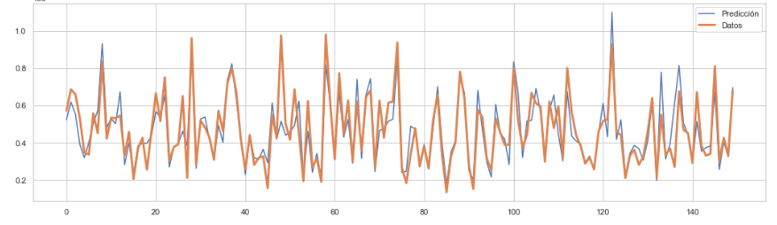

# Predicción de Precios de Casas con Modelos de Machine Learning

## Descripción
Este proyecto tiene como objetivo predecir los precios de las casas en el Condado de King (USA) entrenando y testeando distintos modelos de Machine Learning para encontrar el modelo con mejor desempeño. Para el desarrollo del proyecto se llevaron a cabo los siguientes pasos:
- Análisis exploratorio de datos.
- Tratamiento de valores nulos mediante la imputación con la moda.
- Eliminación de outliers para mejorar la calidad del dataset.
- Reducción de la dimensionalidad mediante eigenvalores, eliminando variables con información redundante.
- Elección de variables reelevantes para entrenar los modelos mediante análisis de correlación con la variable Target.
- Ajuste de hiperparámetros para optimizar los resultados.
- Visualización comparativa entre los valores reales y predichos.

## Dataset
Se utilizó un dataset que incluye múltiples variables relevantes para la predicción del precio de las casas, como:
- Tamaño de la propiedad
- Número de habitaciones
- Latitud
- Cantidad de pisos de la propiedad, entre otros.

El dataset utilizado puede descargarse desde el siguiente enlace: [kc_house_data_NaN.csv](https://cf-courses-data.s3.us.cloud-object-storage.appdomain.cloud/IBMDeveloperSkillsNetwork-DA0101EN-SkillsNetwork/labs/FinalModule_Coursera/data/kc_house_data_NaN.csv)

## Técnicas y Modelos Utilizados
- **Regresión Lineal Múltiple**
- **Árbol de Decisión**
- **Random Forest**
- **Ridge Regression**

- **Ajuste de hiperparámetros** con GridSearchCV

## Resultados
Tras evaluar los modelos con la métrica **R²** y **Desviación Standard**, el mejor desempeño lo obtuvo **Random Forest**, con un R² de **0.77** y una DS de **5923.03**. 
Se encontró que las variables más influyentes en la predicción fueron el tamaño de la casa (sqft_living) y la puntuación general dada a la unidad habitacional en base al sistema de puntuación del condado King (grade).

## Visualizaciones
Se generó un gráfico comparativo entre los precios reales y los precios predichos por el modelo final seleccionado (Random Forest Ajustado).

## Código
Se puede explorar el código en GitHub: https://github.com/mpia87/Venta_de_casas/blob/main/VENTA%20DE%20CASAS.ipynb

## Conclusiones
- **Random Forest** fue el modelo con mejor desempeño.
- El tamaño de la casa y la puntuación general dada a la unidad habitacional en base al sistema de puntuación del condado King, son variables clave para la predicción del precio.
- Se puede entrenar y testear el modelo XGBoost para evaluar su desempeño.

